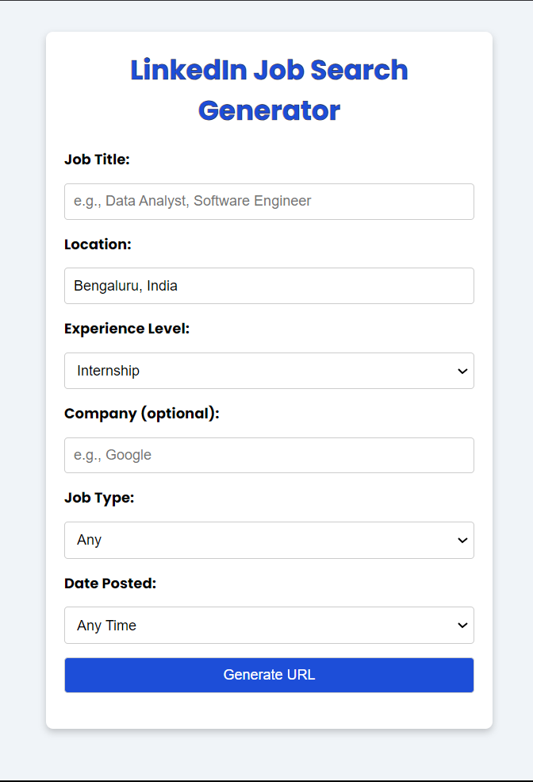
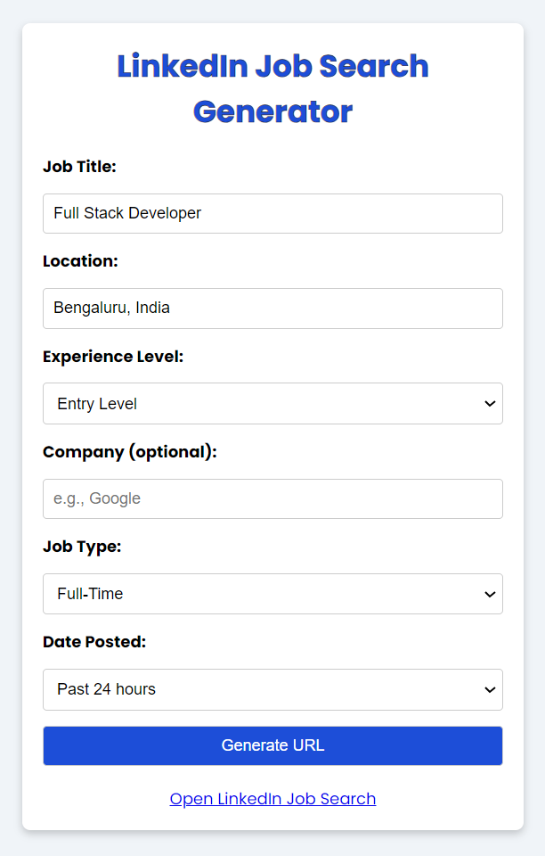

# LinkedIn Job Search Generator

A responsive web application that generates LinkedIn job search URLs based on custom criteria. This tool allows you to quickly generate a URL with filters for job title, location, experience level, company, job type, and date posted to simplify your LinkedIn job search.

## Features
- Interactive form to specify job search criteria.
- Dynamically generates a LinkedIn job search URL based on input.
- Opens a personalized job search in a new tab.
- Responsive design with a LinkedIn-inspired color scheme.

## Live Demo
Check out the live demo on Vercel: [LinkedIn Job Search Generator](https://linkedin-job-finder.vercel.app)

## Usage
1. Open the application and enter your preferred job title, location, experience level, and other optional filters.
2. Click "Generate URL" to create a LinkedIn job search link.
3. Click on the generated link to open LinkedIn with your specified job filters.

## Screenshots

### Initial View
This is the initial screen where you can input your search criteria.

### After URL Generation
Once the URL is generated, a link appears to direct you to LinkedIn.

